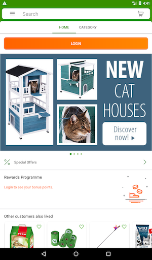
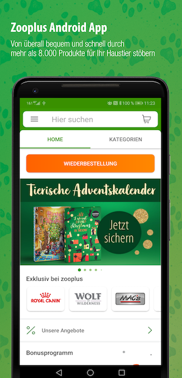

# android-frameit
A tool for rendering a device frame around screenshots with text and a background image. 
Google [recommends not using framed screenshots in Play Store](https://developer.android.com/distribute/marketing-tools/device-art-generator). 
Nevertheless, a lot of companies do that for conversion optimization.

## Related projects
The most famous framing solution is integrated into [fastlane](https://docs.fastlane.tools/actions/frameit/).
It works well for iOS but unfortunately not for Android. Even though there is enough demand for an
[Android](https://github.com/fastlane/fastlane/issues/14968) [implementation](https://github.com/fastlane/fastlane/issues/14796),
at the time of creating this project it did not exists yet.

## Installation
You should have Python with [Pillow](https://pillow.readthedocs.io/en/stable/) installed, 
preferably via [pipenv](https://github.com/pypa/pipenv).

```python
pipenv install
```


## Usage
Edit the src/frameit.py configuration to match your needs and run it.

```python
FramedImage(background_name="frame_dog_paws.png", frame=device_to_frame[device],
                    screen_shot=f"screenshot_{device}.png", output_name=f"output_{device}") \
            .add_text("Zooplus Android App",
                      "Von überall bequem und schnell durch\nmehr als 8.000 Produkte für Ihr Haustier stöbern",
                      title_font='fonts/MYRIADPRO-BOLDCOND.otf', text_font='fonts/HelveticaNeueLTPro-LtCn.otf') \
            .save()
```

It will transform a typical screenshot like



into a framed image with text:



## Credits
Developed for [Zooplus](https://www.zooplus.de/) by [Ulrich Scheller](https://www.ulrich-scheller.de/)
